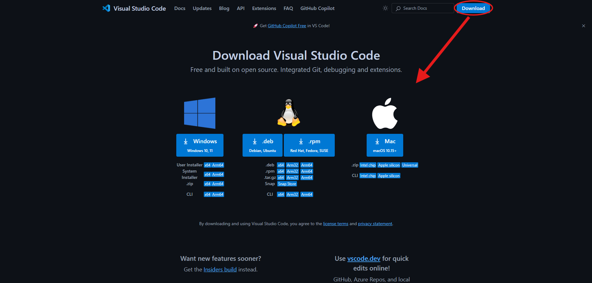
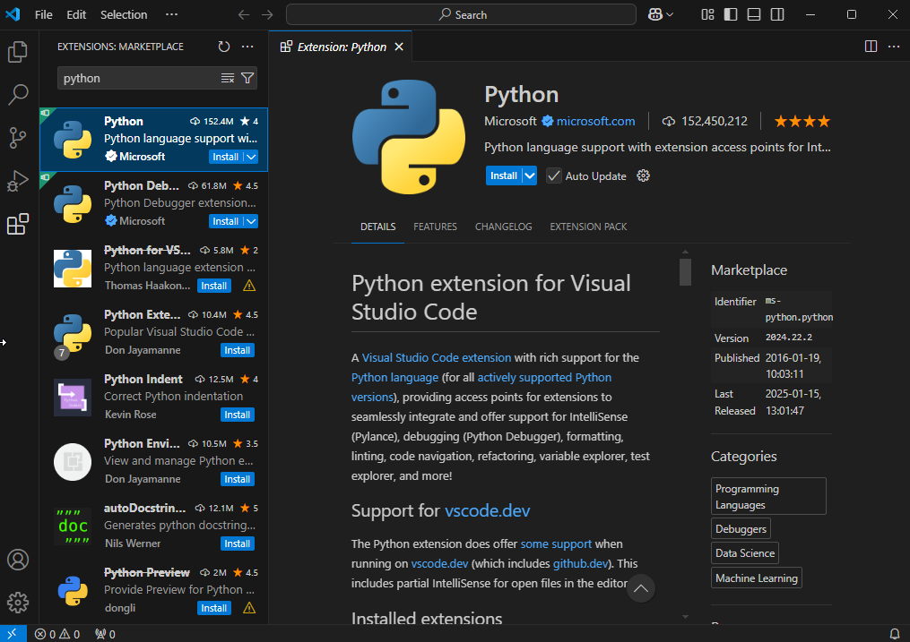
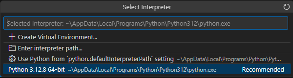

# MNIST Workshop

<div align="center">

| 📅 Date       | 📍 Location | 🕠 Time         |
|:------------:|:-----------:|:---------------:|
| January 30th |  ACEB 1450   | 5:30PM - 9:30PM |

</div>

#

</br>

<details>
<summary><h2 style="display: inline; border-bottom: none;">What is MNIST?</h2></summary>
</br>

The MNIST dataset (Modified National Institute of Standards and Technology database) is a widely used benchmark dataset in machine learning, particularly for image processing and computer vision tasks. Think of it like computer vision's "Hello world!". 

The dataset consists of 70,000 grayscale images of handwritten digits (0-9), each of size 28x28 pixels.

- **Training and Testing:** It is divided into 60,000 training images and 10,000 testing images.

- **Purpose:** The dataset is commonly used to train and evaluate classification algorithms, serving as a foundational task in deep learning and neural network research.

- **Simplicity:** Its small size and pre-processed, normalized format make it ideal for testing models and concepts with low computational overhead.

<div align="center">
    
    <p><em>Convolutional Neural Network of MNIST - Visualization</em></p>
</div>

</br>
</details>

<details>
<summary>
<h2 style="display: inline; border-bottom: none;">What will you get out of it?</h2>
</summary>

</br>

**1. Understanding Neural Networks**

- Learning about neural networks at our workshop provides a hands-on introduction to the foundations of machine learning. You will explore the theory behind how neural networks function, including the role of layers, the concept of a CNN, and the challenges of overfitting. By the end, you will gain a theoretical understanding of AI software engineering and its practical applications in developing intelligent systems.

**2. Hands-On with Machine Learning Frameworks**

- You will gain experience using popular ML frameworks like TensorFlow or PyTorch while working on MNIST. This practical exposure is directly transferable to projects requiring real-world datasets, such as vehicle navigation or obstacle detection.

**3. Confidence Building:**

- Solving MNIST problems helps you grasp the logic behind AI and ML systems in a simple, manageable way. This builds you confidence to dive into more challenging tasks like training models on real-world traffic or environmental data.

**4. A Machine Learning Project YOU made!**

- Who doesn’t want a project showcasing machine learning skills on their resume? A completed MNIST project not only demonstrates technical ability but also signals a willingness to learn and tackle foundational AI problems, making you more attractive to employers in tech and AI industries.

</br>

</details>

<details>
<summary>
<h2 style="display: inline; border-bottom: none;">
How to setup your environment
</h2>
</summary>

</br>

<div align="center">

Before coming in to the workshop please complete the following steps.

</div>

***Note: Windows and MacOS are very similar, thus only key differences are highlighted. If you need help with any part of this setup, be sure to join the Discord here:***

<div align="center">
    <a href="https://discord.gg/HuJCHCSVB2">Discord Link</a>
</div>

</br>

<details>
<summary>
<h3 style="display: inline; border-bottom: none;">1. Download and Install Visual Studio Code (VS Code)</h3>
</summary>

- Open your web browser and go to the [VS Code Download Page](https://code.visualstudio.com/).

- Click the **Download for your OS** button (Windows, Mac, or Linux).

- Once the download is complete, run the installer:
   - **Windows:** Double-click the `.exe` file and follow the prompts.
   - **Mac:** Open the `.dmg` file and drag the VS Code icon to your Applications folder.
   - **Linux:** Follow the instructions provided for your distribution.

- During installation (Windows only):
   - Check the box for **"Add to PATH"** when prompted.
   - Check any other options you find useful, like creating a desktop icon.

<div align="center">
    
    <p><em>Once you load up the page, click "Download" in top right, and choose your OS</em></p>
</div>
</details>

</br>

<details>
<summary>
<h3 style="display: inline; border-bottom: none;">2. Download and Install Python 3.12.x</h3>
</summary>

- Go to the [Python Downloads Page](https://www.python.org/downloads/).

- Scroll down to "Looking for a specific release?"

- Click **Download** on your choice of 3.12.x Python ***(We will be downloading 3.12.8 for this tutorial)***.
   - We are using an older version of Python because you may encounter issues with some library's support for the latest version.

- Scroll to the bottom and choose the installer appropriate for your operating system:
   - **Windows (64-bit):** Select "Windows installer (64-bit)".
   - **Mac:** Select "macOS 64-bit universal2 installer".
   - **Linux:** Follow the instructions provided for your distribution or use the source tarball.

- Run the installer:
   - **Windows:** Check the box for **"Add Python to PATH"** and click **Install Now**.
   - **Mac:** Follow the installation steps.
   - **Linux:** Use your package manager or download the appropriate package.
   
- Verify the installation:
   - Open a terminal or command prompt and type:
     ```ps
     python --version
     ```
     or
     ```ps
     python3 --version
     ```
   - You should see something like `Python 3.12.x`.
</details>

</br>

<details>
<summary>
<h3 style="display: inline; border-bottom: none;">3. Install the Python Extension in VS Code</h3>
</summary>

- Open VS Code.

- Go to the Extensions Marketplace:
   - Click the **Extensions** icon on the left sidebar (it looks like four squares).

- Search for **"Python"** in the search bar.

- Select the extension developed by Microsoft and click **Install**.

- Once installed, restart VS Code to ensure the extension loads properly.

<div align="center">
    
    <p><em>Python Extension Page in VS Code.</em></p>
</div>
</details>

</br>

<details>
<summary>
<h3 style="display: inline; border-bottom: none;">4. Set Up Python in VS Code</h3>
</summary>

- Open VS Code and press **Ctrl + Shift + P** (Windows/Linux) or **Cmd + Shift + P** (Mac) to open the Command Palette.

- Type **"Python: Select Interpreter"** and click on it.

- From the list of Python interpreters, select the one corresponding to Python 3.12.x.
   - If you don’t see it, make sure Python is installed and added to your PATH.

<div align="center">
    
    <p><em>Python Extension Page in VS Code.</em></p>
</div>
</details>

</br>

<details>
<summary>
<h3 style="display: inline; border-bottom: none;">5. Create and Run a Python File in VS Code</h3>
</summary>

- Create a new folder for your project on your computer (e.g., `HelloWorldProject`).

- Open the folder in VS Code:
   - Go to **File > Open Folder...** and select the folder you created.

- Create a new Python file:
   - Click the **New File** button in the Explorer sidebar (or press **Ctrl + N** / **Cmd + N**).
   - Save the file as `hello_world.py` (ensure it has a `.py` extension).

- Write the following code in the file:

   ```python
   print("Hello, World!")
   ```

- Run the Python file:
   - Right-click anywhere in the code editor and select **"Run Python File in Terminal"**.
   - Alternatively, press **Ctrl + F5** (Windows/Linux) or **Cmd + F5** (Mac).

- Check the terminal at the bottom of VS Code for the output. You should see:
   ```
   Hello, World!
   ```
</details>

</br>

<details>
<summary>
<h3 style="display: inline; border-bottom: none;">6. Verify Your Setup</h3>
</summary>

- Confirm that:
   - VS Code is installed and working.
   - Python 3.12.x is installed and added to PATH.
   - The Python extension is installed and configured in VS Code.
   - You can successfully run a Python script and see the output.

- Celebrate! 🎉 You’ve set up your environment and run your first Python program in VS Code!
- You may feels as though this was simple, but we are just getting to the good part!
   - Attend the workshop session to write your first Convolutional Neural Network!
</details>

</br>

<details>
<summary>
<h3 style="display: inline; border-bottom: none;">7. Set Up a Python Virtual Environment (Highly Recommended)</h3>
</summary>

A virtual environment helps isolate your Python projects, ensuring that dependencies for one project don’t conflict with others. This is especially useful when working with machine learning libraries that may have version-specific requirements.

#### Windows

1. **Install `virtualenv`**:
   ```ps
   pip install virtualenv
   ```

2. **Create a virtual environment**:
   Navigate to your project folder, then in the terminal or command prompt and run:
   ```ps
   virtualenv venv
   ```

3. **Activate the virtual environment**:
   ```ps
   .\venv\Scripts\activate
   ```

4. **Verify activation**:
   You should see `(venv)` at the beginning of your terminal prompt, indicating the environment is active.

#### MacOS/Linux

1. **Install `virtualenv`**:
   ```bash
   pip3 install virtualenv
   ```

2. **Create a virtual environment**:
   Navigate to your project folder in the terminal and run:
   ```bash
   virtualenv venv
   ```

3. **Activate the virtual environment**:
   ```bash
   source venv/bin/activate
   ```

4. **Verify activation**:
   You should see `(venv)` at the beginning of your terminal prompt, indicating the environment is active.

#### Why Virtual Environments?

- **Dependency Management**: Keeps project dependencies isolated, avoiding version conflicts.
- **Portability**: Makes it easier to share projects without worrying about global Python package versions.
- **Clean Development Environment**: Prevents clutter in your global Python installation.

> **Tip**: To deactivate the environment, type:
> ```bash
> deactivate
> ```
</details>

</br>

<details>
<summary>
<h3 style="display: inline; border-bottom: none;">8. Install Git and Set Up a Repository (Recommended)</h3>
</summary>

Version control is a key skill for any developer. Git allows you to track changes, collaborate effectively, and revert to previous versions of your code when needed.

#### Windows

1. **Download and install Git**:
   - Visit the [Git website](https://git-scm.com/) and download the installer.
   - Run the installer and follow the default setup instructions.
   - Ensure the option **"Add Git to PATH"** is selected during installation.

2. **Verify the installation**:
   Open a command prompt and type:
   ```ps
   git --version
   ```

#### MacOS/Linux

1. **Install Git**:
   - On MacOS:
     Use homebrew:
     ```bash
     brew install git
     ```

    If you don't have homebrew installed run the following in your terminal:
   ```bash
   /bin/bash -c "$(curl -fsSL https://raw.githubusercontent.com/Homebrew/install/HEAD/install.sh)"
   ```
   
   - On Linux:
     ```bash
     sudo apt-get install git
     ```

1. **Verify the installation**:
   ```bash
   git --version
   ```

#### Set Up a Repository

1. **Initialize a Git repository**:
   In your project folder, run:
   ```bash
   git init
   ```

2. **Add files to the repository**:
   ```bash
   git add .
   ```

3. **Commit your changes**:
   ```bash
   git commit -m "Initial commit"
   ```

4. **Link to a remote repository (e.g., GitHub)**:
   - Create a new repository on GitHub.
   - Copy the repository URL and run:
     ```bash
     git remote add origin <repository-url>
     git branch -M main
     git push -u origin main
     ```

> **Tip**: Git is essential for collaborating on projects and keeping a reliable history of your work. Your best bet to become skillful at Git is practice and some tutorial videos on YouTube.
</details>

</br>

</details>

<details>
<summary>
<h2 style="display: inline; border-bottom: none;">
FAQ (Frequently Asked Questions)
</h2>
</summary>

</br>

**Q: Where is the solution to creating the MNIST CNN (Convolutional Neural Network)?**

    We will update this repository with the full solution and some explanations for certain parts after the completion of the workshop at the previously specified date.

**Q: Do I need prior machine learning experience to attend this workshop?**

    No prior experience is necessary! We will start with the basics of MNIST and Python setup, so beginners are welcome. However, familiarity with Python will be helpful.

**Q: What if I encounter issues setting up Python or VS Code?**

    Please refer to the step-by-step instructions provided in the setup guide. If issues persist, feel free to join our Discord server for assistance.

**Q: Will we use datasets other than MNIST in this workshop?**

    This workshop is focused on MNIST as it is a beginner-friendly dataset. Future, more advanced workshops may include other datasets, such as CIFAR-10 or custom datasets.

**Q: Can I use a Mac or Linux system for the workshop?**

    Yes! The setup instructions are similar for Mac and Linux. We have provided steps for all platforms in the setup guide.

**Q: Is there any cost associated with the workshop?**

    No, this workshop is completely free and open to all students that RSVP'd through the google form shared on all of our socials.

**Q: What tools or frameworks will be used for building the CNN?**

    We will use Python with a popular machine learning library called PyTorch to create and train the CNN.

**Q: Who can I contact if I have questions after the workshop?**

    Join our Discord server or reach out to any of the WEAP organizers. Details will be provided during the workshop.
</details>

</br>

#

<div id="toc">
    <ul style="list-style: none;">
        <summary>
            <h2 style="display: inline; border-bottom: none;">
                <b>Connect with WEAP</b>
            </h2>
        </summary>
    </ul>
</div>

Stay updated and connect with us through our socials:

<br>
<div align="center">
  <table>
    <tr>
      <td align="center"><strong>GitHub</strong></td>
      <td align="center"><strong>Linktree</strong></td>
    </tr>
    <tr>
      <td align="center"><a href="https://github.com/WE-Autopilot">WEAP GitHub Organization</a></td>
      <td align="center"><a href="https://linktr.ee/we.autopilot">WEAP Linktree</a></td>
    </tr>
    <tr>
      <td align="center"><strong>Instagram</strong></td>
      <td align="center"><strong>Discord</strong></td>
    </tr>
    <tr>
      <td align="center"><a href="https://instagram.com/we.autopilot">@WE.AutoPilot</a></td>
      <td align="center"><a href="https://discord.gg/HuJCHCSVB2">Join Our Discord</a></td>
    </tr>
    <tr>
      <td colspan="2" align="center"><strong>LinkedIn</strong></td>
    </tr>
    <tr>
      <td colspan="2" align="center"><a href="https://linkedin.com/company/we-autopilot-club">WEAP on LinkedIn</a></td>
    </tr>
  </table>
</div>
